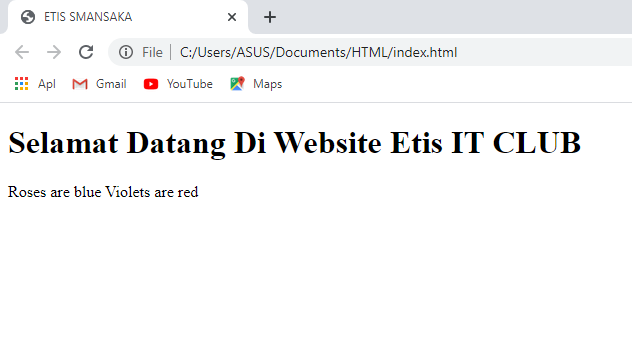

# Apa Itu HTML

Pengertian HTML adalah singkatan dari Hypertext Markup Language, yaitu bahasa markah untuk membuat sebuah halaman website.

Markup adalah bahasa yang didesain dan dikembangkan untuk memproses, mendefinisikan dan mempresentasikan suatu “teks tujuan”.
Bisa dikatakan, HTML itu bahasa paling dasar untuk membuat sebuah website.

Analogi HTML
Biar lebih mudah dalam pemahaman, saya kasih analogi ya.

Website itu ada 2 jenis, yaitu:

1. Website dinamis, adalah web yang kontennya bisa diupdate dengan mudah menggunakan Content Management System (CMS). Contoh: situs berita
2. Website statis, adalah web yang kontennya tidak berubah-ubah. Contoh: profil perusahaan

Nah, untuk membuat sebuah website. Paling tidak dibutuhkan dua buah bahasa pemrograman, yaitu HTML dan CSS.

Analogi atau perumpaaannya sebagai berikut.
Misal kamu ingin membuat sebuah rumah yang bagus, maka kamu harus membangunnya dari dasar bukan? Misal pondasi, tiang, tembok dan genteng.

Nah, itulah dalam web kita butuh HTML. Untuk membuat bentuk rumah tersebut. Pondasi, tiang, tembok itu dinamakan element dalam HTML.
Tidak cukup bangunan rumah jadi, kita harus mempercantik rumah supaya lebih indah. Maka kita akan mengecat rumah, menambah perabotan interior, dll.

Proses memperindah inilah kalau dalam website kita butuh CSS.
CSS singkatan dari cascading style sheet. Intinya kode untuk mempercantik tampilan website.

Analogi lain, HTML itu ibarat kerangka dalam tubuh manusia atau hewan.
Tanpa adanya tulang, kita tidak bisa berdiri bukan?

<hr>

## Fungsi HTML

- Mengintegrasikan tulisan dan gambar
- Membuat kumpulan pranala / link
- Membuat form interaktif
- Membuat teks lebih berfariatif, seperti tulis tebal, tulis miring, dll
- Membuat layout sebuah website
- Sebagai bahasa utama yang dirender oleh web browser

<hr>

## Kelebihan HTML

- Mudah dipelajari
- Sebagai bahasa awal di era Internet
- Banyak digunakan di seluruh dunia, sehingga dukungan komunitasnya besar
- Didukung oleh semua web browser standar
- Gratis!
- Bahasanya rapi, terstruktur dan konsisten
- Sangat mudah diintegrasikan dengan bahasa lain, seperti Javascript, CSS dan PHP

## Kekurangan HTML

- Jika hanya pakai HTML saja, website tidak bisa dinamis hanya statis dan tampilannya jelek
- HTML tidak memungkinkan melakukan fungsi logika
- Jika versi HTML dan browsernya tidak sama, maka semua fitur tidak bisa ditampilkan (contoh: dulu banyak web developer yang menyerah membuat tampilannya keren di internet explorer)

# Software Yang Dibutuhkan

Sebelum belajar HTML pastikan telah menginstall beberapa aplikasi dibawah

Untuk PC/Laptop:

1. Text Editor
2. Web Browser

## Text Editor

Untuk menulis kode HTML dibutuhkan aplikasi, aplikasi text editor yang umum digunakan ialah:

- [Sublime](https://www.sublimetext.com/)
- [Visual Studio Code](https://code.visualstudio.com/)
- [Notepad++](https://notepad-plus-plus.org/downloads/)

Sebelumnya, perlu kalian ketahui bahwa struktur penulisan dan syntax sebuah file HTML harus disimpan dengan ekstensi .html.

Apa itu ekstensi? Ekstensi adalah jenis format suatu file, misal jika jenis dokumen ada ekstensi .DOC, .PDF, kalau audio format .mp3, dll.

Berikut ini adalah struktur kode HTML yang paling dasar:

```html
<!DOCTYPE html>
<html>
  <head>
    <title>ETIS SMANSAKA</title>
  </head>
  <body>
    <h1>Selamat Datang Di Website Etis IT CLUB</h1>
    <p>Roses are blue Violets are red</p>
  </body>
</html>
```

Menghasilkan hasil seperti ini:



Catatan penulisan kode html:

- Semua kode harus diawali dengan `<!DOCTYPE html>`

- Setelah deklarasi, harus diawali dan diakhir dengan `<html>....</html>`

- Semua yang ditampilkan di web browser ada di `<body>...</body>`

- Semua identitas halaman ditaruh di `<head>...</head>`
